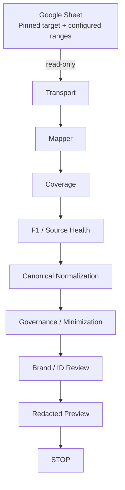

# Sprint 1 Architecture and Authority Boundaries

## Purpose and status

This document freezes the intended authority boundaries for the Sprint 1 **Read-only Google Production Evidence Dry-run**. It is a planning artifact, not implementation authority. The only permitted terminal state of the slice is redacted evidence followed by `STOP`.

## Current capability map at the frozen base

| Capability | Frozen-base state | Sprint 1 implication |
| --- | --- | --- |
| `SheetsReader` and Google-shaped DTOs | Implemented as offline, injectable, immutable contracts; `read()` returns only `SpreadsheetSnapshot` | Preserve this compatibility surface, but do not pretend it can carry configured-range coverage proof. Add a typed application boundary that binds snapshot + proof without a side channel. |
| Raw Google API response mapper | Missing | S1-WP0 must map camelCase response structures into the frozen DTOs without loss or raw persistence. |
| Configured-range coverage proof | Missing | S1-WP0 must bind the request selection to returned ranges and fail closed on any unproved segment. |
| Deterministic source fingerprint | Implemented for `SpreadsheetSnapshot` | S1-WP2 may compute F1 only after coverage succeeds; selection/config evidence remains separately bound in the run envelope. |
| Merge-aware cell normalization | Implemented as per-cell offline contracts | S1-WP3 must add production sheet/field orchestration without reusing legacy blind fill-down behavior. |
| Permanent canonical IDs and lineage | Implemented as contracts | IDs remain Google-governed inputs; Sprint 1 reports missing/conflicting IDs but does not allocate or backfill them. |
| Oral-only early minimization | Implemented for Public Metric input contracts | It remains a mandatory stage before any preview or persistence-ready output. |
| URL safety and Content Asset resolution | Implemented offline | URL candidates may be validated as evidence; no URL grants network capture authority. |
| Redacted sync preview | Implemented for Sprint 0 asset/oral-only shapes | It does not fully express brand candidates, ID diagnostics, configured-range coverage, or source health; a versioned Sprint 1 evidence shape or reviewed extension is required. |
| Production Google auth/transport | Missing | S1-WP1 must enforce the approved credential, target, and egress boundaries. |
| Production dry-run application service | Missing | S1-WP5 must orchestrate only approved stages and hard-stop before every downstream production surface. |
| Legacy local Excel flow | Implemented and in use | Preserve it unchanged; the new path is additive and must not reinterpret legacy Markdown as authority. |

## Frozen authority invariants

1. **Google Sheets = Official metadata / identity / governance authority.**
2. **Linked webpage = CapturedContent body only.** Sprint 1 does not fetch or create that body.
3. **Evidence URL ≠ capture authority.** A URL is an offline reference candidate, never implicit egress permission.
4. **Markdown ≠ Official authority.** Markdown remains a legacy or future sibling projection, not an input to this dry-run.
5. **Redacted preview = Evidence only.** It is non-authoritative, non-apply, non-release, and non-activation.
6. Derived canonical objects preserve source meaning and lineage; they do not replace Google as business authority.
7. `resolved_candidate` or `needs_review` does not mean active, publishable, externally quotable, or approved.
8. Primary Content, Evidence, Manual Enrichment, and Public Metric claim authority remain distinct.
9. Oral-only, pending, restricted, and handle-mapping boundaries remain mandatory even though the dry-run creates no index.

## Production data flow

The controlled Sprint 1 flow is exactly:

```text
Google Sheet (exact pinned target + configured ranges)
  ↓ read-only
Transport
  ↓
Mapper
  ↓
Coverage
  ↓
F1 / Source Health
  ↓
Canonical Normalization
  ↓
Governance / Minimization
  ↓
Brand / ID Review
  ↓
Redacted Preview
  ↓
STOP
```



There is deliberately no arrow to CapturedContent, Markdown, Vault, index, Release, activation, scheduler, Slack, or any other production consumer.

The full diagram is the implementation and non-live integration slice. The first live read is more restrictive and follows this mandatory checkpoint branch:

```text
Google Sheet
  → Transport
  → Mapper
  → Coverage
  → F1 / Source Health counts
  → BASELINE STOP
  → Human baseline review
  → Explicit human baseline decision
```

Before that decision, the production snapshot does not continue to canonical normalization, governance/minimization, brand/ID review, or the full preview stage. The narrower live checkpoint does not redefine the complete Option A business slice.

What happens to the later Option A production stages after the explicit baseline decision remains `OPEN_POLICY`. Planning Exit Review must explicitly select or defer a safe model; neither an in-memory pause/resume nor a second read is silently authorized here. Until then, the full Option A slice is validated only with synthetic/mocked integration evidence, and Sprint 1 exit must record the Product/Governance Owner’s disposition of the Frozen Audit brand-candidate approval point.

## Layer contracts

### 1. Configuration boundary

The runtime configuration must be reviewed data, not caller discretion. It supplies:

- the exact allowlisted Spreadsheet ID;
- versioned configured ranges;
- versioned fields mask;
- the expected sheet/range contract needed for coverage;
- safe, non-secret policy/version identifiers;
- an optional approved preview destination reference, never a default path.

The configuration API must not accept an arbitrary Spreadsheet target from the dry-run caller. Configuration identity and version may enter audit evidence; secret values may not.

The exact production range list and exact Google fields-mask string are `OPEN_IMPLEMENTATION_DECISION`. Frozen sources establish this semantic lower bound:

- `spreadsheets.get` with `includeGridData=true`;
- explicit ranges covering the required source sheets and required brand mapping/review sheets;
- required hidden sheets must not be omitted because they are hidden;
- spreadsheet/sheet properties sufficient to prove identity, title, hidden state, and grid bounds;
- each returned `GridData.startRow` and `GridData.startColumn` offset needed to reconstruct absolute coordinates for non-A1 and multi-range blocks;
- merges;
- `formattedValue`, `effectiveValue`, `userEnteredValue`, `hyperlink`, `textFormatRuns.startIndex`, `textFormatRuns.format.link`, and `dataValidation` for configured cell ranges.

`spreadsheets.values.get`, implicit whole-workbook selection, and a broad fields mask used only for convenience are not acceptable substitutes.

Google may omit empty trailing rows/cells and represent interior empty cells as empty objects. The mapper contract therefore freezes these canonical sparse rules:

- configured A1 bounds and the coverage proof establish the requested extent; absence of trailing empty `RowData`/`CellData` entries is not itself truncation when Google’s sparse encoding accounts for it;
- `GridData.startRow`/`startColumn` plus row/value position establish absolute coordinates;
- a cell object for which **all requested semantic fields are absent** is omitted from `SpreadsheetSnapshot.cells`, whether Google returned `{}` or omitted it;
- a present empty string, `false`, zero, formula, error, hyperlink, text-format run, or data-validation value is semantic and must be preserved;
- omitted-zero, interior-empty, and trailing-empty representations of the same configured source state must map to the same snapshot and F1;
- coverage proof, not synthesized blank `CellData`, records the configured empty extent;
- response block order is incidental; overlapping or ambiguous block identity fails closed rather than last-write-wins.

### 2. Google authentication and transport authority

The transport is the only layer allowed to receive a credential handle or interact with Google authentication. It may call only the Google Sheets read-only API for the exact configured target.

The transport must:

- assert the pinned target before network use;
- request read-only scope only;
- have no write method, writer client, mutation scope, batch-update path, Apps Script client, or execute authority;
- accept credential material through the separately approved runtime mechanism;
- keep token, credential, auth headers, and auth exception details within the credential/transport boundary;
- translate failures into stable, sanitized error codes;
- return the response directly to the mapper without debug serialization or durable raw caching;
- perform only bounded behavior after timeout/retry policy is separately frozen.

If the environment supports only a long-lived JSON key, transport construction must stop before credential use and request a Security Owner decision.

### 3. Response mapper authority

The mapper may see configured production cell values transiently because it must translate the Google response. It receives no credential, token, auth header, credential path, or arbitrary target control.

It must preserve, without business inference:

- spreadsheet identity needed for target binding;
- sheet ID, exact title, hidden state, row count, and column count;
- absolute cell coordinates across all returned grid blocks;
- formatted, effective, and user-entered value branches;
- whole-cell hyperlink and ordered rich-text link runs;
- data-validation metadata;
- merge ranges and their sheet binding;
- all configured response blocks needed by the coverage proof.

The mapper must reject unknown/ambiguous shapes, duplicate coordinates, invalid offsets, overlapping or out-of-bounds merges, target mismatch, and any response shape that cannot be mapped losslessly. Its DTO output is still sensitive in-memory source material; DTO serialization support is not persistence permission.

The raw `SpreadsheetSnapshot` may legitimately contain cell payload in memory and its frozen DTO currently has a payload-bearing default repr. It must never be logged, embedded in exceptions, used as a pytest/golden snapshot, or treated as safe evidence. Before production eligibility, WP0 must either harden those repr surfaces compatibly or encapsulate the raw DTO behind a redacted typed result so application/logging paths cannot expose it; the chosen mechanism is an entry-reviewed implementation decision with Pydantic 1.x and 2.x tests.

### 4. Coverage authority

Coverage is a blocking proof, not a health warning. It binds:

- configured target identity;
- request/config version;
- the exact configured range set;
- each request part if multiple requests are later approved;
- returned sheet/range/grid blocks and their coordinates;
- required sheet properties and merge/cell-data availability;
- absence of missing, duplicated, truncated, silently partial, or unexpected response segments.

Coverage may produce safe counts, range identifiers or hashes, and stable error codes. It must not output raw cells. No downstream F1, normalization, preview, or “success” result is permitted unless completeness is proved.

The application-facing boundary is a typed configured-read result (working name `ConfiguredReadResult`) containing the `SpreadsheetSnapshot`, coverage proof, and safe config/version binding. It is distinct from the frozen `SheetsReader.read() -> SpreadsheetSnapshot` compatibility protocol. Snapshot and proof must travel together through this result; globals, mutable reader state, logs, or another side channel are forbidden.

If Google API semantics do not permit a reliable proof for the chosen ranges or batching design, Sprint 1 stops for an architecture decision. It must not label best-effort data as complete.

### 5. F1 and source-health authority

F1 is the existing deterministic fingerprint of the coverage-proven `SpreadsheetSnapshot`. The existing fingerprint covers canonicalized snapshot content; it does not itself attest to the request range/fields configuration. Therefore the Sprint 1 run envelope must bind, separately and deterministically:

- F1;
- configuration/version identity;
- configured-range coverage proof identity;
- mapper/schema/policy version identifiers;
- safe source-health counts.

No change to frozen F1 semantics should be made merely to hide this distinction. Any proposed F1 schema change requires explicit contract review and compatibility tests.

Sprint 1 also retains the Frozen Audit Sprint 1 F1/F2 **test helper** contract. The pure helper accepts a second independently coverage-proven configured result under the exact same frozen target/config selection, computes the second fingerprint under the same mapper/fingerprint versions, and compares F1/F2 without any network, publish, archive, or activation side effect. Synthetic and mocked tests provide the second result. This helper is distinct from the Sprint 5 release-time source-F2/commit gate. The first controlled live smoke remains one read at the baseline checkpoint; this plan does not authorize a second live read.

The application does not pass the run envelope and sensitive snapshot as independently swappable values. WP2 produces an opaque typed in-memory batch context (working name `CoverageProvenBatchContext`) that couples the original `ConfiguredReadResult` to its F1/source-health envelope. WP3 and WP5 accept that context, validate its immutable target/config/coverage/F1 bindings, and cannot reconstruct or replace its snapshot through a side channel. The context is sensitive staging, not serializable audit evidence and not safe for default repr/logging.

For `FIRST_LIVE_BASELINE`, WP2/WP5 additionally return a separate versioned redacted baseline-evidence object. It contains only the approved target/config/coverage references or hashes, F1, safe counts/structural codes, and `HUMAN_REVIEW_REQUIRED`; its deterministic evidence hash excludes correlation ID, latency, retry count, timestamps, and other telemetry. It contains no canonical normalization, brand/ID candidates, or full preview. In-memory return is the default; durable persistence remains prohibited unless the explicit output gate covers this schema and destination.

Source health classifies structural facts such as required sheet/header presence, bounds, entity/ID coverage, exclusions, issues, and anomalous decline. On the first live run, it may report facts and blocking structural failures, but it cannot invent a threshold and self-approve the baseline. The outcome must be `HUMAN_REVIEW_REQUIRED` (or an equivalent frozen enum) after counts are produced.

### 6. Derived canonical staging authority

Canonical normalization occurs in memory after coverage and F1. It may derive typed entities, source lineage, resolved values, and safe candidates from Google source material under the frozen Sprint 0 contracts.

The staging layer:

- is not a durable official store;
- cannot allocate MREC, BRD, or MET;
- cannot treat row, path, title, name, handle, website, or URL as permanent identity;
- cannot turn suggestions into approvals;
- cannot reverse-map legacy Markdown or `DocumentMetadata` into canonical authority;
- must preserve citations/source lineage, metadata, status, and freshness-related evidence needed by later review;
- must use an explicit one-based canonical source-row conversion rather than leaving row-base semantics implicit.

The exact production sheet/field registry, date conversion rules, and normalized Sprint 1 batch/envelope schema are `OPEN_IMPLEMENTATION_DECISION` where the frozen contracts do not uniquely decide them.

### 7. Governance and minimization authority

Governance is a mandatory pipeline stage, never an optional caller flag.

- Oral-only content is irreversibly reduced to the frozen safe exclusion shape before preview, logging, persistence, brand review, or any persistence-ready canonical object.
- Pending metrics remain non-official and non-quotable.
- Restricted-customer input remains governance/denylist evidence only and does not enter general retrieval or citation.
- Handle mapping remains normalization/brand-review evidence only and does not become BRD authority.
- Valid rows in the non-public customer sheet enter the denylist preview regardless of NDA-field value.
- Multiple merchant-case rows for the same brand/handle remain separate interview records. They are not deduplicated or overwritten; only frozen exact-field duplicate conditions may create a human review item.
- Exposure channels, `can_quote_externally`, status warnings, and evidence authority are preserved rather than inferred away.
- Evidence URLs may pass the offline URL validator, but no candidate grants network authority.

### 8. Brand / ID review authority

Brand and ID outputs are review candidates only. They may report:

- missing, malformed, formula-derived, duplicate, reused, or conflicting MREC/MET/BRD evidence;
- unique, ambiguous, or conflicting handle/website grouping evidence;
- absence of an approved BRD mapping;
- safe lineage and stable reason codes.

They may not:

- allocate, reserve, write, backfill, merge, split, approve, or overwrite IDs;
- treat name alone, handle, website, URL, or source order as identity authority;
- silently choose among ambiguous candidates;
- reuse the legacy last-write-wins handle mapping behavior.

The exact brand grouping algorithm and the versioned review-candidate wire schema remain `OPEN_IMPLEMENTATION_DECISION`, constrained by these frozen rules.

### 9. Evidence authority

The Sprint 1 output is redacted evidence. Allowed evidence is limited to safe identifiers, lineage references, configured-range/record counts, hashes, version identifiers, status/severity, stable reason codes, timings, retry counts, and reviewed safe metadata.

The evidence object cannot be consumed as:

- an Official metadata store;
- a release input;
- an apply plan;
- an activation instruction;
- a Vault or index source;
- proof that business content is approved;
- proof that a first-live baseline passed human review.

A deterministic artifact hash may prove which redacted evidence was reviewed. It does not make the artifact authoritative.

### 10. CapturedContent authority

Sprint 0 contains CapturedContent contracts, but Sprint 1 does not create, refresh, persist, or activate CapturedContent. Linked webpages remain potential body sources for a later authorized capture stage. Primary and Evidence parent roles remain mutually exclusive, and Evidence body can never expand an approved metric claim or exposure permissions.

### 11. Markdown authority

Markdown is outside the dry-run path. It is neither read as an Official source nor written as an output. The legacy `local XLSX → preview/review/apply → managed Markdown → content index` path remains available but unchanged. A future canonical-to-legacy adapter may be one-way for parity; reverse promotion from Markdown to canonical authority is forbidden.

### 12. Persistence authority

Before the preview output gate is frozen, all source snapshots, canonical staging, governance inputs, and review candidates remain in process memory only.

Durable **business/source evidence** persistence is allowed only for the final redacted evidence and only when all of the following are explicit and approved:

- destination;
- destination allowlist/binding;
- ACL;
- allowed fields/schema version;
- retention;
- cleanup procedure;
- artifact deletion/rollback procedure.

No default destination exists. `reports/`, `data/`, `obsidian_vault/`, `.mka/`, and other existing production/runtime directories cannot be selected for convenience.

A separately reviewed minimal smoke-invocation claim/used/closed record is security control-plane state, not business/source evidence. It may exist only to enforce one-run authority after its owner, store, ACL, non-content fields, atomic claim, crash/lease semantics, retention, audit, and exact cleanup/disable procedure are frozen. It contains no source data, F1, target in cleartext, credential, or secret and grants no knowledge persistence authority.

## Credential boundary

```text
Approved credential provider
  → Google auth / read-only transport
  → sanitized transport result
  → mapper and all later layers

Credential/token/auth header/secret path
  └─ MUST NOT CROSS THIS BOUNDARY ─┘
```

Configuration may identify which approved provider to use, but must not carry the secret itself into the business pipeline. Secret-bearing exception objects must be sanitized or replaced before leaving transport.

## Network boundary

| Network action | Sprint 1 authority |
| --- | --- |
| Google authentication for approved read-only identity | Allowed only in separately authorized production smoke/runtime context |
| Google Sheets read-only API for pinned target/configured ranges | Allowed only in separately authorized production smoke/runtime context |
| Google write/batchUpdate/Apps Script | Forbidden |
| Linked URL HTTP, DNS content classification, redirects | Forbidden |
| Generic HTTP client, crawler, scraper | Forbidden |
| Slack, external LLM, arbitrary API | Forbidden |
| Scheduler-triggered network | Forbidden |

Unit, contract, synthetic integration, mocked-adapter, and safe regression tests remain zero-network. A live controlled smoke is not ordinary pytest.

## Persistence boundary

| Data class | In-memory processing | Durable Sprint 1 output |
| --- | --- | --- |
| Credential/token/auth header | Transport boundary only | Never |
| Raw Google response / raw configured-range snapshot | Transient mapper/coverage only | Never |
| Oral-only body/notes/evidence URL | Short-lived pre-minimization only | Never |
| Restricted/pending raw body | Short-lived governance processing only | Never |
| Canonical normalized source payload | In-memory staging only | Never |
| Brand/ID review evidence | In-memory candidate | Only if included in the approved redacted schema and output gate |
| Source-health/count evidence | In-memory result | Only through the approved redacted output gate |
| Redacted preview | Yes | Optional, explicit approved target only |

## Legacy compatibility

- Do not modify `models.py` or `ingestion.py` to host Google canonical state.
- Do not route the Google response through `excel_preview.py` or legacy `excel_ingestion.py`; their local XLSX and oral-only semantics are not the new authority path.
- Do not modify existing Excel, review/apply, Obsidian, content-index, retrieval, generation, Slack, or one-off execution entry points as a side effect of Sprint 1.
- New canonical-to-legacy compatibility, if ever required, is one-way and belongs to a later reviewed migration package.
- Removing the new adapter/config wiring and revoking its read access must leave the existing local Excel flow unchanged.

## Architecture stop conditions

Planning or implementation must stop if any of the following is true:

- exact configured ranges/fields cannot be frozen without broadening to the entire workbook;
- the Google response cannot prove complete configured-range coverage;
- target identity can be supplied or changed by an arbitrary caller;
- only a long-lived JSON credential is available without Security Owner approval;
- the adapter needs write scope, Apps Script authority, or non-Google egress;
- raw snapshot, credential, oral-only body, restricted/pending body, or unsafe URL would enter logs, exceptions, previews, fixtures, or durable storage;
- governance can be bypassed by a caller;
- a brand/ID candidate is auto-approved, merged, allocated, or written;
- source health is automatically marked `PASS` from first-live self-derived thresholds;
- a dry-run path reaches CapturedContent, Markdown, Vault, index, release, activation, scheduler, or Slack;
- a legacy runtime module must be broadly refactored to make the slice work.
