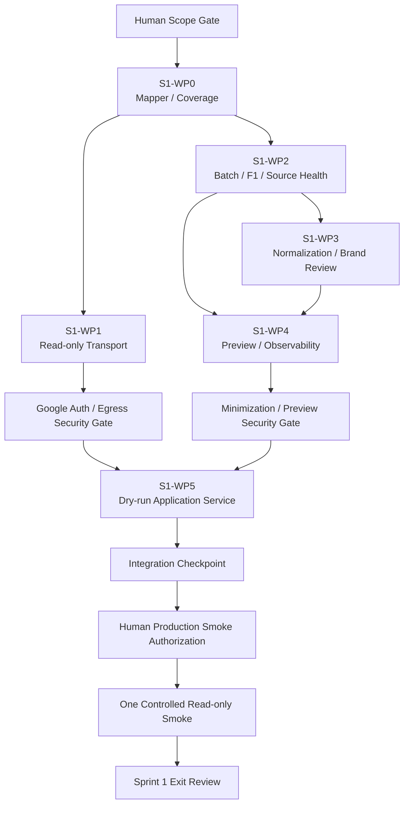

# Sprint 1 Work Packages and DAG

## Planning status and file rule

This document defines future implementation packages only. It does not create or authorize any source file, dependency, credential, configuration, network call, or production run.

“Likely files” are planning forecasts used to bound review. Final names and exact diffs must be frozen at each implementation package entry review. A listed path is not blanket permission to modify it. Every package must preserve unrelated work and must stop if its actual diff expands beyond the reviewed package.

Global forbidden paths for every package:

- `.env` and any credential/key file;
- `reports/`, `data/`, `obsidian_vault/`, and `.mka/`;
- all frozen Sprint 0 Audit, Planning, Final Authorization, and incident records;
- production runtime artifacts, local private data, and scope-outside untracked paths;
- release, activation, Vault, index, capture, scheduler, Slack, and external-LLM state.

Shared Sprint 1 test harness files are established by S1-WP0 before any other package tests:

- new `tests/sprint1/conftest.py`, reusing `install_offline_test_guards` so the autouse network/persistence guard actually applies to the new test subtree;
- new `tests/sprint1/test_offline_harness.py`, proving direct socket/HTTP and known production-runtime writes are blocked while isolated temporary/in-memory behavior remains available.

The existing `tests/sprint0/conftest.py` does not govern `tests/sprint1/`; merely asserting that its guard remains active would be false without this new harness.

## S1-WP0 — Google response mapper / coverage contract

### Goal

Define and implement a lossless, payload-safe mapping from the exact Google `spreadsheets.get` response shape into the frozen Sprint 0 `SpreadsheetSnapshot`, plus a fail-closed proof that every configured range was returned completely, and bind both in one typed configured-read result.

### Inputs

- Pinned Spreadsheet target and versioned read configuration.
- Exact configured ranges and fields after their `OPEN_IMPLEMENTATION_DECISION` is resolved.
- Raw Google response supplied by an injected/mock client for tests or by S1-WP1 at runtime.
- Existing `SheetsReadRequest`, `SpreadsheetSnapshot`, `SheetSnapshot`, `CellData`, value, link, validation, and merge contracts.
- Frozen sheet-schema requirements and hidden-sheet rules.

### Outputs

- A typed `ConfiguredReadResult` (working name) that holds the mapped `SpreadsheetSnapshot`, configured-range coverage proof, and safe config/version binding together in memory.
- A stable sanitized blocking error instead of a result when mapping or coverage fails.
- Safe structural facts: request/config version, expected/observed range counts, sheet IDs/titles or their approved safe references, and coverage outcome.
- No raw response dump and no durable snapshot.

### Likely files

- New `src/marketing_knowledge_agent/google_sheets_read_contracts.py`.
- New `src/marketing_knowledge_agent/google_sheets_response_mapper.py`.
- New `tests/sprint1/test_google_sheets_response_mapper.py`.
- New `tests/sprint1/test_google_sheets_configured_range_coverage.py`.
- New `tests/sprint1/conftest.py` and `tests/sprint1/test_offline_harness.py`.
- Conditional on the reviewed repr-containment decision: `src/marketing_knowledge_agent/sheets_contracts.py` plus `tests/sprint0/test_sheets_contracts.py` and source-fingerprint regression. A raw DTO repr is currently payload-bearing and cannot be assumed safe.

### Forbidden files

- `src/marketing_knowledge_agent/models.py`.
- `src/marketing_knowledge_agent/ingestion.py`.
- `src/marketing_knowledge_agent/excel_preview.py` and `excel_ingestion.py`.
- `src/marketing_knowledge_agent/cli.py`.
- Capture, release, Obsidian, indexing, retrieval, generation, and Slack modules.
- `pyproject.toml` (WP0 is transport-independent).

### Dependencies

- Human Scope Gate.
- Owner Decision 2 and Owner Lock 1.
- Frozen Sprint 0 Sheets DTO and fingerprint contracts.
- Resolution of exact ranges/fields is required before production configuration is accepted, but mapper mechanics may begin against synthetic explicit configurations.

### Unit tests

- Map every `GoogleValue` branch without coercing business meaning.
- Preserve formatted/effective/user-entered values, formula provenance, whole-cell links, ordered rich-text runs including every `TextFormatRun.startIndex`, validation, hidden state, grid bounds, cells, and merges.
- Convert multi-grid response offsets to correct absolute coordinates.
- Canonicalize Google sparse encoding: all-fields-absent `{}`/omitted cells become absence; present empty string/false/zero/formula/error/link/run/validation remains semantic.
- Prove omitted-zero, interior-empty, and trailing-empty variants of the same configured source state map to the same snapshot and F1.
- Reject duplicate/out-of-bounds cells, invalid/overlapping merges, target mismatch, malformed response unions, and unsupported shapes.
- Canonicalize only incidental response ordering; preserve semantic ordering.

### Contract tests

- Mapper output validates against the frozen `SpreadsheetSnapshot` contract.
- Every configured range has exactly one provable coverage disposition.
- Coverage binds the pinned target, config version, request parts, returned grid blocks, and expected bounds.
- `GridData.startRow`/`startColumn` and row/value positions bind every non-A1/multi-range block to absolute coordinates.
- `ConfiguredReadResult` is the only application-facing success shape; snapshot and proof cannot be separated or reconstructed through reader state/global side channels.
- Required hidden sheets remain represented.
- `includeGridData=true` and the reviewed fields mask are part of the request/coverage contract.
- No use of `spreadsheets.values.get` can satisfy the contract.

### Negative tests

- Missing range, missing request part, missing required sheet, missing grid data, partial grid block, unexpected truncation, duplicate range, extra ambiguous response block, renamed sheet, and inconsistent grid bounds all block.
- A syntactically non-empty but unapproved range or fields tuple is rejected.
- A response for another Spreadsheet is rejected even if its shape is otherwise valid.
- The mapper cannot claim completeness when Google response semantics are ambiguous.

### Security tests

- Raw response and sentinel cell bodies may exist only in the transient in-memory response/DTO needed for lossless mapping. They do not appear in application-safe repr, exceptions, logs, pytest/golden snapshots, or durable test artifacts.
- The chosen repr-containment mechanism is tested under supported Pydantic 1.x/2.x behavior; direct raw DTO repr is never classified as safe evidence.
- Mapper accepts no credential, token, auth header, secret path, or write-capable client.
- Network and filesystem persistence guards remain active in all WP0 tests.
- Validation errors expose stable codes, not caller payloads.

### Stop conditions

- Exact configured-range completeness cannot be proven.
- The only workable design broadens to an unrestricted workbook read.
- Mapping requires raw-response persistence or debug dumps.
- Required Google fields cannot be represented without breaking frozen Sprint 0 contracts.
- A backward-incompatible DTO change is required and has not received separate review.

### Definition of Done

- All configured Google response shapes map losslessly into frozen DTOs under synthetic tests.
- Coverage is independently testable, deterministic, and fail closed.
- Partial or ambiguous results cannot reach F1.
- Mapper errors and diagnostics are payload-safe.
- The shared Sprint 1 offline/persistence autouse guard and its self-tests pass.
- Actual diff remains within the reviewed WP0 file set.

### Rollback boundary

Remove the new mapper/coverage modules and tests, plus any explicitly reviewed backward-compatible DTO extension. There is no entrypoint, credential, network configuration, production data, or data rollback.

## S1-WP1 — Read-only transport / credential boundary

### Goal

Implement a dedicated transport that can authenticate through an approved runtime mechanism and issue only the exact read-only Google Sheets request for the pinned target, while preventing credential and write authority from crossing into the rest of the pipeline.

### Inputs

- S1-WP0 request and response contracts.
- Pinned target and versioned configuration.
- A credential-provider handle conforming to the separately approved runtime mechanism.
- Approved Google Sheets read-only scope.
- Frozen stable error/redaction requirements.

### Outputs

- A production `ConfiguredRangeReader` (working name) whose application-facing method returns S1-WP0 `ConfiguredReadResult`; a bare `SpreadsheetSnapshot` is not sufficient for WP2/WP5.
- Preservation of the frozen `SheetsReader` protocol for existing synthetic/compatibility callers without using that bare-snapshot protocol as the production success boundary.
- Sanitized transport result or stable error classification.
- Safe retry/latency facts after timeout/retry policy is frozen.
- No writer client, credential artifact, raw auth response, or generic HTTP surface.

### Likely files

- New `src/marketing_knowledge_agent/google_sheets_transport.py`.
- New `src/marketing_knowledge_agent/google_sheets_runtime_config.py`.
- New `tests/sprint1/test_google_sheets_transport.py`.
- New `tests/sprint1/test_google_sheets_credential_boundary.py`.
- Conditional after dependency review: if both `pyproject.toml` and legacy `setup.py` remain supported installation paths, any new Google client requirement must be declared compatibly in both. Their pre-existing unrelated metadata differences are not silently reconciled in WP1. Consolidating packaging authority instead requires a separately reviewed packaging change. No dependency files change if an approved existing runtime supplies the client.

### Forbidden files

- Any `.env`, JSON key, token cache, credential fixture, or secret-bearing configuration.
- `src/marketing_knowledge_agent/cli.py` and scheduler/Slack entrypoints.
- Mapper-downstream canonical, governance, preview, release, capture, Vault, or index modules except imports of their public contracts.
- Any file that adds Google write, Drive, or Apps Script authority.

### Dependencies

- S1-WP0.
- Credential policy approved; concrete credential runtime remains an entry decision.
- Exact target/range/field configuration frozen.
- Timeout, bounded retry, 429/5xx, deadline, and batching decisions resolved sufficiently for transport implementation.

### Unit tests

- Build only the approved `spreadsheets.get` read call with `includeGridData=true`, exact target, ranges, and fields.
- Reject missing, mismatched, arbitrary, fallback, discovered, or caller-overridden targets.
- Translate permission, auth, quota, timeout, 429, and 5xx outcomes into stable sanitized error codes under the approved policy.
- Prove the adapter exposes no write/batchUpdate/Apps Script method.

### Contract tests

- The production application adapter returns `ConfiguredReadResult` through S1-WP0 mapping/coverage; WP2/WP5 reject the bare `SheetsReader.read() -> SpreadsheetSnapshot` shape.
- Existing synthetic `SheetsReader` compatibility remains tested without adding write methods or treating it as coverage evidence.
- Credential-provider objects never appear in mapper or downstream function signatures.
- Read-only OAuth/API scope and Spreadsheet permission assumptions are asserted at construction/review boundaries.
- Multiple requests, if approved, share one bounded run and one complete coverage contract.

### Negative tests

- Long-lived JSON-only runtime without Security Owner authorization stops before authentication.
- Writer scope, broader Drive scope used as a substitute, Apps Script authority, target mismatch, active-spreadsheet fallback, and arbitrary range injection are rejected.
- Retry exhaustion cannot return a partial “success.”
- Sanitization failure blocks propagation of the original exception.

### Security tests

- Token, credential, auth header, client repr, secret path, and injected secret sentinels never enter logs, exceptions, preview inputs, or artifacts.
- Mock tests assert no non-Google host or unapproved Google endpoint is contacted.
- Transport does not follow linked URLs or redirects for content.
- The dependency surface contains no writer convenience wiring.
- When both installation paths remain supported, targeted packaging tests prove the newly required Google dependency and compatible constraint are present through both paths; they do not claim the pre-existing full dependency sets are identical.

### Stop conditions

- Only a long-lived JSON key is available and no separate Security Owner approval exists.
- Minimum read-only permission/scope cannot be established.
- The chosen client silently adds discovery, fallback target, write, Drive, or generic egress authority.
- Sanitized error handling cannot prevent credential/raw response disclosure.
- Required dependency change is incompatible or unreviewed.

### Definition of Done

- Mocked transport tests prove exact target, read-only scope, exact method/selection, sanitized failures, and zero write surface.
- Credential objects are confined to the credential/transport boundary.
- Network authority is mechanically narrow and reviewable.
- No real credential is created or used during implementation tests.
- Actual diff remains within the reviewed WP1 file set.

### Rollback boundary

Disable/remove adapter and config wiring, remove any isolated dependency addition, and revoke/delete the approved runtime binding through its owning system. Existing local Excel behavior remains unchanged. No production data rollback applies.

## S1-WP2 — Batch / F1 / source-health envelope

### Goal

Create a deterministic in-memory run envelope that accepts only a coverage-proven configured-range snapshot, computes F1, validates snapshot integrity and source-health facts, and forces the first-live result into human baseline review rather than automatic PASS.

### Inputs

- S1-WP0 typed `ConfiguredReadResult`; WP2 does not accept a bare snapshot or a separately supplied proof.
- Versioned configuration identity.
- Existing canonical source serialization and F1 computation.
- Frozen structural schema, header, ID, merge, and source-health requirements.
- Optional historical baseline only after separately approved evidence exists.

### Outputs

- Service-generated opaque run/batch correlation ID. Production callers cannot supply it; tests may inject a controlled ID factory.
- F1/source fingerprint.
- A pure/mockable Sprint 1 F1/F2 second-result comparison helper that requires the same frozen target/config and a second coverage-proven configured-read result; the helper owns no read and is distinct from Sprint 5 release-time F2. No second live call is authorized by this output.
- Configuration/coverage/schema/policy version bindings.
- Safe per-range, sheet, entity, exclusion, and issue counts.
- Structural/source-health disposition, including mandatory first-live `HUMAN_REVIEW_REQUIRED`.
- An opaque sensitive in-memory `CoverageProvenBatchContext` (working name) that immutably couples the original `ConfiguredReadResult` and its F1/source-health envelope for WP3/WP5; it is not independently serializable, persistable, repr-safe, or swappable with another snapshot.
- A versioned redacted `FirstLiveBaselineEvidence` (working name) containing only reviewed config/coverage references or hashes, F1, safe counts/structural codes, and `HUMAN_REVIEW_REQUIRED`, plus a deterministic evidence hash that excludes telemetry.
- No raw snapshot bytes/cells in the baseline evidence or other safe outputs, and no threshold invention, archive list, release state, brand candidate, or full-preview content.

### Likely files

- New `src/marketing_knowledge_agent/google_sheets_dry_run_contracts.py`.
- New `src/marketing_knowledge_agent/google_sheets_source_health.py`.
- New `src/marketing_knowledge_agent/google_sheets_fingerprint_check.py` (or an equivalently isolated pure helper).
- New or colocated versioned first-live baseline-evidence contract; exact file is frozen at WP2 entry.
- New `tests/sprint1/test_google_sheets_dry_run_contracts.py`.
- New `tests/sprint1/test_google_sheets_source_health.py`.
- Existing `canonical_serialization.py` is expected to be consumed unchanged; modification requires a separate compatibility justification and expanded Sprint 0 regression.

### Forbidden files

- `src/marketing_knowledge_agent/release_contracts.py` and all release/activation/journal modules.
- Obsidian, SQLite/FTS/vector, archive, capture, scheduler, Slack, and `last_success` paths.
- Legacy Excel and Markdown ingestion modules.
- Any durable baseline or production snapshot file.

### Dependencies

- S1-WP0.
- A proven configured-range coverage result.
- Owner Decision 5.
- Threshold policy is not required for synthetic structural checks, but no first-live health PASS may exist before later human baseline approval.

### Unit tests

- F1 is deterministic for incidental sheet/cell/merge ordering and changes for semantic source changes under the frozen serializer.
- F1/F2 test helper rejects target/config/coverage/mapper-version mismatch, accepts independently coverage-proven configured results, and reports equal/different without its own network, publish, archive, or activation behavior. It is not the Sprint 5 release-time source-F2 gate.
- Envelope binds F1 to config, coverage, and version identities without pretending those inputs are already inside F1.
- `CoverageProvenBatchContext` construction binds the exact configured result to that envelope; independently supplied or reconstructed snapshot/envelope pairs are impossible through public constructors.
- Validate critical sheet/header presence, grid bounds, merge validity, ID format/coverage/duplicates, and safe counts.
- First-live mode always returns human review required after structural checks.
- Baseline evidence serialization/hash is deterministic for semantic evidence, excludes runtime telemetry, and cannot include WP3/WP4 fields.

### Contract tests

- No F1 or source-health envelope can be constructed without a valid coverage proof.
- WP3/WP5 receive the opaque batch context, not independently replaceable envelope and snapshot arguments.
- The same configured snapshot yields the same canonical source-health evidence. WP2 owns the distinct first-live baseline-evidence hash; WP4 owns only the full-preview artifact hash. Both canonical hash boundaries exclude runtime telemetry.
- All count dimensions reconcile with exclusions/issues and configured-range coverage.
- Synthetic/mocked F1/F2 second-result tests use the exact same selection and independently valid coverage proofs; the helper owns no read and a live second read remains unauthorized.
- Future threshold evaluation, once frozen, is versioned and never rewrites first-live evidence.

### Negative tests

- Missing/renamed critical sheet, header drift, invalid bounds, duplicate/malformed/formula-derived IDs, count/coverage inconsistency, fingerprint failure, and unapproved baseline all block.
- A caller cannot supply `source_health_pass=true` or a self-derived threshold.
- A partial snapshot cannot be fingerprinted through the application boundary even if the low-level pure helper could accept a DTO.
- A bare snapshot, a proof supplied through mutable reader state/global state, or a mismatched `ConfiguredReadResult` is rejected.
- A batch context with altered/replaced snapshot, config, proof, envelope, or F1 binding is rejected before WP3/WP5.
- Baseline evidence rejects raw cells, canonical/brand/preview fields, unsafe identifiers, telemetry inside its deterministic hash boundary, or an outcome that claims human approval.
- Caller-supplied correlation IDs, newline/control characters, oversized values, or IDs derived from target/user/business payload are rejected; the production service generates the opaque ID internally.
- “No previous baseline” cannot be treated as healthy by default.

### Security tests

- Envelope/log output contains no raw cells, claims, notes, evidence URLs, private bodies, or target ID in cleartext observability.
- F1 and safe aggregate counts are not treated as reversible substitutes for raw data.
- Error and count reconciliation failures use stable codes only.
- Correlation-ID format/length is bounded and payload-independent; exact wire scheme is frozen at WP2 entry and tested without embedding source identity.
- Batch-context repr/log/error paths are payload-safe even though the contained configured result is sensitive; baseline evidence sentinel scans prove the redacted schema is safe.
- Tests remain zero-network and zero-production-persistence.

### Stop conditions

- Coverage and F1 cannot be bound unambiguously.
- Required source-health facts would require persisting raw source.
- First-live logic can mark itself PASS without human review.
- Thresholds, deadlines, or counts are invented rather than reviewed.
- F1 semantics must change without an explicit version/compatibility decision.

### Definition of Done

- A coverage-proven synthetic snapshot produces deterministic F1 and reconciled safe evidence.
- Structural failures fail closed.
- First-live mode ends in human review required.
- Pure/mocked F1/F2 comparison contract and selection-integrity tests pass without helper-owned I/O or a second live-read path.
- No release, archive, apply, or activation type exists in the WP2 output.
- Actual diff remains within the reviewed WP2 file set.

### Rollback boundary

Remove the new envelope/source-health modules and tests. No persistent source, baseline, release, or production state exists. If a future approved threshold configuration was deployed, revert that configuration independently without touching Google or legacy data.

## S1-WP3 — Canonical normalization / brand review candidates

### Goal

Compose the frozen normalization, identity, governance, and minimization contracts over the coverage-proven batch to produce non-authoritative in-memory canonical staging objects plus redacted brand/ID review candidates, without auto-approval, persistence authority, or mutation.

### Inputs

- S1-WP2 opaque `CoverageProvenBatchContext`, which couples the original `ConfiguredReadResult` and its run envelope; WP3 accepts neither a bare snapshot nor independently supplied snapshot/envelope arguments.
- Frozen sheet/field registry after its implementation decision.
- Existing merge-aware normalization, canonical IDs/models, early metric minimization, URL safety, link resolution, and uniqueness contracts.
- Frozen governance rules for merchant cases, restricted customers, public/pending metrics, handle mapping, status, exposure, citations, and evidence.

### Outputs

- Non-authoritative in-memory canonical staging objects that have passed the relevant construction/minimization contracts. The Sprint 0 type name `PersistenceEligibleMetricInput` proves only its early-minimization gate; it does not grant Sprint 1 persistence authority.
- Safe `ExcludedSourceRef` and other governance-only/exclusion facts.
- Brand candidates classified as unique, ambiguous, or conflicting evidence.
- ID diagnostics for missing, malformed, formula-derived, duplicate, reused, or conflicting MREC/MET/BRD inputs.
- Redacted review-candidate inputs with safe lineage and stable reason codes.
- No assigned ID, mutation plan, write request, approval, or release candidate.

### Likely files

- New `src/marketing_knowledge_agent/google_sheets_canonical_normalization.py`.
- New `src/marketing_knowledge_agent/brand_review_candidates.py`.
- New `tests/sprint1/test_google_sheets_canonical_normalization.py`.
- New `tests/sprint1/test_brand_review_candidates.py`.
- Existing `cell_normalization.py`, `google_normalization.py`, `canonical_models.py`, `link_resolution.py`, and `url_safety.py` should be consumed through public contracts; any modification requires targeted compatibility review and existing Sprint 0 regression.

### Forbidden files

- Legacy `models.py`, `ingestion.py`, `excel_preview.py`, and `excel_ingestion.py` as canonical implementation homes.
- Apps Script, allocator, registry, writeback, or Google mutation modules.
- Vault/index/release/capture/Slack/generation code.
- Preview persistence destinations.

### Dependencies

- S1-WP2.
- Frozen/approved production sheet-field registry and row-base/date semantics.
- Brand grouping and Sprint 1 review-candidate schema decisions resolved enough to implement deterministically.

### Unit tests

- Map fields using merge-aware rules; no blind fill-down.
- Use effective/formatted values correctly and reject missing formula cache/type conflicts.
- Convert source coordinates to explicit one-based canonical lineage.
- Validate MREC/BRD/MET format and batch uniqueness.
- Classify unique/ambiguous/conflicting handle and normalized website evidence without last-write-wins behavior.
- Preserve separate merchant interviews; only exact frozen duplicate fields produce review items.
- Include every valid non-public customer row in denylist/governance output regardless of NDA flag.

### Contract tests

- Public construction accepts only the bound batch context and rejects any replaced/mismatched target, config, coverage proof, snapshot, envelope, or F1 identity.
- Public Metric construction is possible only after early minimization yields `PersistenceEligibleMetricInput`.
- `PersistenceEligibleMetricInput` and any resulting canonical object remain in-memory/non-authoritative in Sprint 1 and cannot be routed to a durable authority store.
- Oral-only output contains only the frozen safe exclusion shape.
- Pending, restricted, and handle-mapping inputs cannot enter an Official/publishable result.
- Evidence URL remains evidence and cannot create/expand a metric claim or network request.
- Brand suggestion evidence cannot construct an approved `BrandIdentityDecision` without the separate human-approved shape.
- No identity depends on row, path, name, handle, website, URL, or candidate order.

### Negative tests

- Bare snapshots, standalone run envelopes, reconstructed pairings, and mismatched batch contexts are rejected before normalization.
- Ambiguous/conflicting mapping cannot select a winner.
- Blank BRD cannot auto-create a brand.
- Duplicate/malformed/formula-derived/reused ID blocks or needs review according to the frozen classification; it is never silently repaired.
- Two distinct safe canonical URLs yield `needs_review`, not a selected candidate.
- A caller cannot bypass governance or directly serialize transient `MetricSourceCells`.

### Security tests

- Oral-only, restricted, and pending sentinels are absent from non-authoritative canonical staging outputs where prohibited, application-safe repr, exceptions, logs, review candidates, and serialized preview inputs.
- Unsafe/full URLs do not appear in errors or diagnostics.
- No network, filesystem persistence, credential, or Google client is available to WP3.
- Aggregate/identity diagnostics do not disclose excluded body content.

### Stop conditions

- Governance is optional or can be bypassed.
- Brand/ID logic auto-allocates, merges, approves, overwrites, or backfills.
- Legacy row-derived identity or blind fill-down must be reused.
- Oral-only or other prohibited body reaches a review/persistence-ready object.
- Exact field/date/row semantics remain ambiguous enough to change business meaning.

### Definition of Done

- Synthetic configured-range batches normalize deterministically under frozen identity and governance rules.
- Every sensitive class is minimized/separated before preview.
- All ambiguous brand/ID cases remain explicit human review candidates.
- No write, apply, release, capture, or activation surface exists.
- Actual diff remains within the reviewed WP3 file set.

### Rollback boundary

Remove the new orchestration/review-candidate modules and tests, plus any explicitly reviewed compatible extension. Because results are in memory and non-authoritative, no business-data rollback or ID reversal applies.

## S1-WP4 — Redacted preview / minimal observability

### Goal

Build deterministic, reviewable, payload-safe evidence from WP2/WP3 outputs and expose only the minimum observability necessary to diagnose a dry-run, with durable output disabled unless the explicit output gate is frozen.

### Inputs

- S1-WP2 coverage/F1/source-health envelope.
- S1-WP3 minimized canonical facts and brand/ID review candidates.
- Versioned preview schema and stable error/reason taxonomy.
- Optional explicit approved output policy: destination, ACL, fields, retention, cleanup.

### Outputs

- In-memory deterministic redacted JSON/Markdown-compatible evidence model.
- Safe run telemetry: correlation ID, stage, hashed target, versions, counts, F1, latency, retry count, safe errors, redacted-evidence artifact hash, and outcome. Telemetry is not itself part of the deterministic artifact bytes.
- Optional durable redacted artifact only through the approved output gate.
- Explicit labels: Evidence only / Non-authoritative / Non-apply / Non-release / Non-activation.

### Likely files

- New `src/marketing_knowledge_agent/google_sheets_dry_run_preview.py`.
- New `src/marketing_knowledge_agent/google_sheets_dry_run_observability.py`.
- New `tests/sprint1/test_google_sheets_dry_run_preview.py`.
- New `tests/sprint1/test_google_sheets_dry_run_observability.py`.
- A dedicated versioned Sprint 1 artifact is preferred over overloading `sync-preview-v1`; modifying `sync_preview.py` requires a separate schema-compatibility decision.
- A durable sink module is not likely until destination/ACL/retention/cleanup/allowed-fields policy is frozen.

### Forbidden files

- Default-output configuration and all writes to `reports/`, `data/`, `obsidian_vault/`, or `.mka/`.
- Raw snapshot/cache/debug dump modules.
- Logging configuration that enables unredacted exceptions.
- Official source, apply, release, Vault, index, capture, scheduler, Slack, or activation modules.

### Dependencies

- S1-WP2 and S1-WP3.
- Minimization / Preview Security Gate before S1-WP5.
- Versioned Sprint 1 evidence schema decision.
- Durable persistence additionally depends on all output policies being frozen; in-memory mode does not.

### Unit tests

- Deterministic ordering and serialization of safe items/issues/counts.
- Artifact hash covers only canonical redacted evidence bytes. It changes for semantic evidence changes, remains stable for incidental input ordering, and excludes correlation ID, latency, retry count, timestamps, and other per-run telemetry.
- Hashed target identity is deterministic and raw target is not emitted in telemetry.
- Stage/outcome/error enums reject arbitrary free text.
- Evidence labels are present and cannot be set to authoritative/apply/release/active.

### Contract tests

- All WP2/WP3 blocking, review, excluded, and warning categories reconcile with preview counts.
- Full preview contains sufficient safe evidence for brand/ID human review under synthetic/mocked integration and any later separately authorized post-baseline production execution. The first-live baseline checkpoint itself uses only the narrower WP2 counts/source-health evidence before `STOP`.
- No output adapter can write without an explicit approved destination/policy object.
- In-memory mode succeeds without a filesystem path.
- Existing Sprint 0 preview contracts remain compatible if reused as nested safe evidence.

### Negative tests

- Missing output policy blocks durable mode without inventing a default.
- Paths under forbidden production/runtime directories are rejected.
- Unknown field, free-text error, raw source payload, full URL, or unredacted exception cannot enter the preview.
- Preview cannot be parsed as an apply/release/activation instruction.
- A blocking source-health result cannot be relabeled as success by rendering.

### Security tests

- Credential, token, auth header, raw cell, oral-only, restricted, pending, unsafe URL, and private-body sentinels are absent from JSON, Markdown, telemetry, logs, errors, and artifact metadata.
- Exception sanitizer is tested with nested causes and client exceptions.
- ACL/destination binding fails closed when durable mode is enabled.
- Cleanup/retention behavior is tested only after policy exists, against temporary synthetic storage.

### Stop conditions

- The review need cannot be met without raw content.
- Output destination, ACL, allowed fields, retention, or cleanup is missing for durable production mode.
- Existing preview schema would need misleading field overloading.
- Observability requires full target ID, full URL, raw exception, or business payload.
- Any output could be treated as Official, applyable, releasable, or active.

### Definition of Done

- Deterministic in-memory evidence and minimal telemetry pass targeted tests and sentinel scans.
- Durable mode is impossible without the full explicit output policy.
- The artifact is clearly and structurally non-authoritative.
- Counts reconcile; no prohibited payload appears.
- Actual diff remains within the reviewed WP4 file set.

### Rollback boundary

Disable/remove preview and telemetry adapters. Delete only explicitly identified Sprint 1 preview artifacts under their approved cleanup policy; do not touch unrelated files or authority stores. In-memory results require no data rollback.

## S1-WP5 — Dry-run application service / integration checkpoint

### Goal

Compose S1-WP0–S1-WP4 behind both security gates into one fail-closed application service with two explicit state machines: the complete Option A flow for synthetic/mocked non-live integration, and the narrower first-live baseline flow that terminates after WP2 counts/source health. No state machine continues production data past the baseline `STOP` without a later owner policy and new explicit authority.

### Inputs

- Approved WP0 mapper/coverage service.
- Approved WP1 read-only transport and runtime config boundary.
- Approved WP2 bound batch context plus versioned first-live baseline-evidence contract.
- Approved WP3 canonical/governance/brand-review service.
- Approved WP4 preview/observability service.
- Frozen execution mode: `NON_LIVE_FULL_SLICE` or `FIRST_LIVE_BASELINE`. No generic “continue” flag exists.
- Passed Google Auth / Egress Security Gate.
- Passed Minimization / Preview Security Gate.

### Outputs

- For `NON_LIVE_FULL_SLICE`, a typed dry-run result containing safe outcome, F1, coverage/source-health evidence, counts, review status, and optional approved preview artifact reference/hash, followed by final `STOP`.
- For `FIRST_LIVE_BASELINE`, only a versioned payload-safe `FirstLiveBaselineEvidence` with reviewed config/coverage references or hashes, F1, safe counts/structural codes, `HUMAN_REVIEW_REQUIRED`, and its deterministic evidence hash, followed by baseline `STOP`; no WP3/WP4 production-data output.
- An Integration Checkpoint evidence package for code/security/repository review.
- A production smoke *candidate* package, not a smoke execution.
- Guaranteed no downstream production activation or mutation.

### Likely files

- New `src/marketing_knowledge_agent/google_sheets_dry_run.py`.
- New `tests/sprint1/test_google_sheets_dry_run_integration.py`.
- New `tests/sprint1/test_google_sheets_dry_run_security.py`.
- Existing Sprint 0 integration/offline harness tests should be reused as regression evidence, not modified to call production.

### Forbidden files

- `src/marketing_knowledge_agent/cli.py`, scheduler, Slack, webhook, and automation entrypoints.
- Production smoke scripts or ordinary pytest tests containing a live credential/target call.
- Google writer/Apps Script, CapturedContent, Markdown, Vault, index, release, pointer, journal, archive, `last_success`, or activation modules.
- Legacy Excel runtime wiring.

### Dependencies

- S1-WP1 and S1-WP4.
- Google Auth / Egress Security Gate passed.
- Minimization / Preview Security Gate passed.
- All package-level tests and reviews complete.

### Unit tests

- Within each named execution mode, stage ordering is fixed; no generic caller-controlled skip/reorder surface exists.
- `NON_LIVE_FULL_SLICE` has two approved zero-network test compositions: a synthetic configured reader may inject a WP0 `ConfiguredReadResult` into WP2 → WP3 → WP4 → final `STOP`; the mocked-adapter composition must exercise WP1 transport → WP0 mapper/coverage → WP2 → WP3 → WP4 → final `STOP`.
- `FIRST_LIVE_BASELINE` has the separate runtime order WP1 read-only transport → WP0 mapper/coverage → WP2 → baseline `STOP`. The implementation dependency `WP0 → WP1` does not reverse the runtime data flow. This owner-locked checkpoint is not a caller skip.
- Failure at any stage prevents all later stages except safe failure evidence.
- First-live mode always stops for human baseline review and has no continuation method/callback into WP3/WP4.
- First-live baseline evidence is the only safe production-data result: it is structurally unable to carry raw cells, the bound batch context, canonical/brand fields, full preview, human approval, or downstream instructions.
- Service construction rejects unapproved components, arbitrary targets, output paths, or downstream callbacks.

### Contract tests

- Synthetic end-to-end composition reuses the frozen DTO/F1/minimization/authority contracts.
- Mocked network adapter receives exactly one approved read plan and no write/extra egress call, then its response traverses WP0 mapper/coverage and the remaining non-live Option A stages end to end.
- Synthetic/mocked non-live integration proves complete Option A; live-smoke eligibility proves only the baseline checkpoint unless the open post-baseline policy is later resolved and separately authorized.
- First-live output validates against the frozen baseline-evidence schema/hash contract and remains in memory unless that exact schema is covered by an approved durable output policy.
- Output reconciles with all stage counts and stable outcomes.
- Integration checkpoint contains review evidence, not a release candidate.
- Local Excel and safe legacy regression remain unchanged.

### Negative tests

- Missing/failed security gate, partial response, target mismatch, source-health block, governance leak, preview policy failure, or artifact failure prevents success.
- Caller cannot request a downstream apply, release, archive, index, capture, Slack, or activation action.
- Green tests cannot trigger a production read.
- A first-live result cannot be marked approved without a separate human baseline decision.
- A first-live result cannot contain canonical normalization, brand/ID candidate, or full-preview production evidence, and cannot accept an approval/continue token.
- Raw or mismatched batch context data, telemetry inside the deterministic baseline hash, unsafe repr, or an unversioned baseline evidence object is rejected.

### Security tests

- Global network guard permits only the injected mock in ordinary tests; no live host is reachable.
- Persistence spies prove no write to Vault, database, vector, Markdown, release, runtime directories, or forbidden output paths.
- End-to-end sentinel scans cover credentials, auth headers, raw cells, oral-only, restricted, pending, URLs, HTML/private body, and unredacted exceptions.
- Baseline-evidence bytes/repr/hash inputs receive the same sentinel and safe-field scans as other evidence.
- Correlation/telemetry evidence contains only the approved allowlist.

### Stop conditions

- Either security gate is incomplete or fails.
- Integration requires a CLI/scheduler/live-test shortcut.
- Any stage can be bypassed or reordered to weaken governance.
- Any downstream production state changes.
- A production read is proposed before explicit human smoke authorization.
- The first-live baseline would be auto-approved.
- A caller attempts to use `NON_LIVE_FULL_SLICE` with a production transport or to resume a stopped baseline run.

### Definition of Done

- Unit, contract, synthetic integration, mocked-adapter, security, and safe local regression suites pass with recorded commands/results.
- The application service terminates at versioned redacted evidence: full preview evidence for non-live Option A, or the narrower first-live baseline evidence; neither exposes downstream authority.
- Complete Option A passes approved synthetic/mocked integration; first-live smoke candidate is explicitly baseline-only pending the open post-baseline owner policy.
- Code, security, credential, network, preview, rollback, and repository review packets are ready.
- A smoke candidate may be presented for human authorization; no smoke has been run.
- Actual diff remains within the reviewed WP5 file set.

### Rollback boundary

Disable/remove the application service and new wiring, remove approved adapter/config bindings, revoke the read credential binding, and clean up only explicitly approved preview artifacts. Legacy flows and all authority stores remain unchanged. Release rollback is not applicable.

## Package entry freeze gates

These gates make the `OPEN_*` items actionable without altering the owner-required inter-package DAG. A package may begin only the explicitly allowed subset shown below; it cannot call an open decision “implementation detail” and proceed through production acceptance.

| Gate | Human/review owner | Required decision artifact | Blocks |
| --- | --- | --- | --- |
| Configuration / Selection Freeze Gate | Product/Governance + Security + Repository review | Pinned target binding, exact ranges, exact fields mask including grid offsets and `textFormatRuns.startIndex`, schema titles/columns, range-specific selection registry, config version/hash | WP0 production-contract acceptance and all WP1 implementation |
| Raw DTO Containment Gate | Security + Repository review | Reviewed choice between compatible repr hardening and encapsulation, with Pydantic 1.x/2.x tests | WP0 production-contract acceptance |
| Transport Policy Freeze Gate | Security + Repository review | Credential runtime, timeout, request deadline, bounded retry, 429/5xx policy, batching, dependency/packaging decision | WP1 implementation |
| Correlation ID Contract Gate | Security + Repository review | Service-generated opaque ID grammar/length and test-only injection boundary | WP2 implementation |
| Baseline Evidence Schema Gate | Product/Governance + Security + Repository review | Versioned safe fields/labels, config/coverage/F1 binding, canonical serialization/hash excluding telemetry, repr/error safety, and output-policy relationship | WP2 first-live acceptance and WP5 `FIRST_LIVE_BASELINE` mode |
| Normalization / Brand Contract Freeze Gate | Product/Governance + Security + Repository review | Production field registry, row/date rules, brand grouping algorithm, review-candidate schema/reason taxonomy | WP3 implementation |
| Evidence Schema Gate | Product/Governance + Security + Repository review | Versioned redacted evidence schema and deterministic hash boundary excluding telemetry | WP4 implementation |
| Durable Preview Output Gate | Product/Governance + Security + Repository review | Destination, ACL, allowed fields, retention, cleanup, exact rollback | WP4 durable mode only; in-memory mode remains possible |
| Controlled Smoke Invocation Gate | Security + Repository + explicit human operator authorization | Reviewed invocation mechanism; commit/config/credential/approval binding; approved minimal non-content control store/ACL/retention/audit; atomic pre-read `unused → claimed`; concurrent/replay fail-close; crash/lease disposition; terminal used/closed state; immediate disable/revoke procedure | Any live controlled smoke |
| Post-baseline Option A / Brand Disposition Gate | Product/Governance Owner, with Security/Repository review if execution expands | Explicit freeze/defer of later production stages, brand candidate approve/split/merge/exclude handling, and threshold-draft disposition | Any post-baseline production processing and `SPRINT1_EXIT_READY` |

`READY_FOR_SPRINT1_IMPLEMENTATION` is a program-level planning exit value, not a bypass around this table. At most it allows entry into the first package whose own gates are complete. In particular, `READY_FOR_S1_WP1_IMPLEMENTATION = NO` until the Configuration/Selection and Transport Policy gates pass.

## Security-gate mapping to the DAG

The thirteen security gates in `03_TEST_SECURITY_OBSERVABILITY_ROLLBACK.md` map to the two composite pre-WP5 DAG gates and later checkpoints as follows:

| DAG/checkpoint gate | Numbered security gates that must pass |
| --- | --- |
| Google Auth / Egress Security Gate | 1 Credential, 2 Target, 3 Egress, 4 Completeness, 5 Snapshot Integrity, plus credential/config portions of 11 Rollback |
| Minimization / Preview Security Gate | 6 Production Data, 7 Oral-only Minimization, 8 Logs/Exceptions, 9 Preview, 10 Persistence, plus preview-artifact portions of 11 Rollback |
| Integration Checkpoint | Reconfirm gates 1–10 end-to-end; complete overall 11 Rollback and 12 Audit Evidence |
| Human Production Smoke Authorization → One Controlled Read-only Smoke | 13 Live Smoke, including the Controlled Smoke Invocation Gate and explicit one-run human authorization |

If a numbered sub-gate is incomplete, its composite gate is incomplete. The two short DAG labels do not reduce or replace the thirteen blocking reviews.

## Dependency DAG

### Text DAG (normative)

```text
Human Scope Gate
  → S1-WP0

S1-WP0
  → S1-WP1

S1-WP0
  → S1-WP2

S1-WP2
  → S1-WP3

S1-WP2
  → S1-WP4

S1-WP3
  → S1-WP4

S1-WP1
  → Google Auth / Egress Security Gate

S1-WP4
  → Minimization / Preview Security Gate

Google Auth / Egress Security Gate
  + Minimization / Preview Security Gate
  → S1-WP5

S1-WP5
  → Integration Checkpoint

Integration Checkpoint
  → Human Production Smoke Authorization

Human Production Smoke Authorization
  → One Controlled Read-only Smoke

One Controlled Read-only Smoke
  → Sprint 1 Exit Review
```

### Mermaid rendering (informative)



## DAG enforcement rules

- A dependency edge is blocking, not advisory.
- Synthetic fixtures, mocks, skip flags, `xfail`, hardcoded output, or manual construction of a downstream type cannot substitute for a failed upstream gate.
- Option F may be used only as a bounded internal checkpoint/fallback within this DAG. It cannot bypass Option A or satisfy the Integration Checkpoint/Sprint 1 exit alone.
- The first-live smoke is intentionally restricted by Owner Decision 5 to the read/coverage/F1/source-health checkpoint and then `STOP` for human baseline review. That safety restriction does not rename the checkpoint as the primary business slice; Option A must already be complete through approved non-live integration evidence.
- Human Scope Gate does not authorize production smoke.
- Integration Checkpoint does not authorize production smoke.
- Only the explicit Human Production Smoke Authorization edge allows one controlled read-only smoke.
- Failure or withdrawal at either security gate blocks S1-WP5 and every live-read edge.
